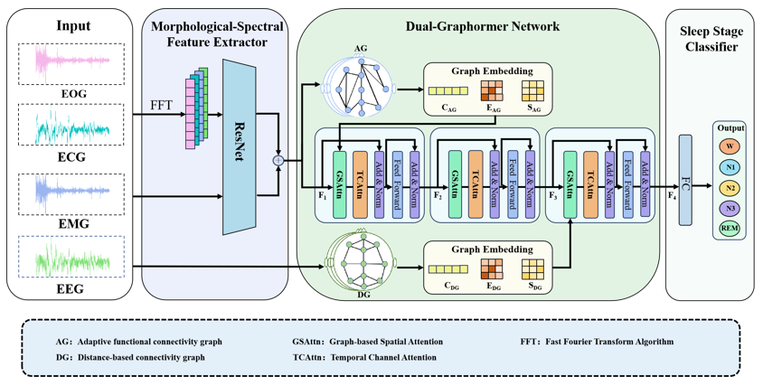

# DGraphormer-SleepNet

DGraphormer-SleepNet: A Dual-graphormer-based Method for Sleep Stage Classification, which is improved from StAGN(https://github.com/Chen-Junyang-cn/StAGN/tree/main).

# Citation
If you find this useful, please cite our work as follows:

# Dataset
The ISRUC dataset can be downloaded from website: https://sleeptight.isr.uc.pt

# Preprocess
Run <code>preprocess.py

python preprocess.py

# Train model
You can change the input data path and run. Note that the output from MSFE is the DGraphormer-SleepNet's input.
